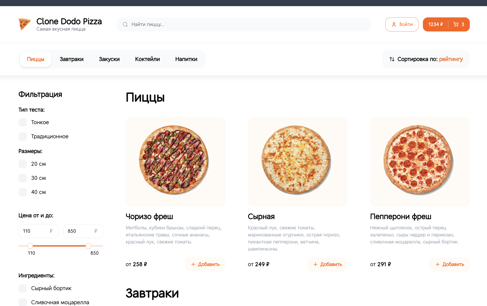
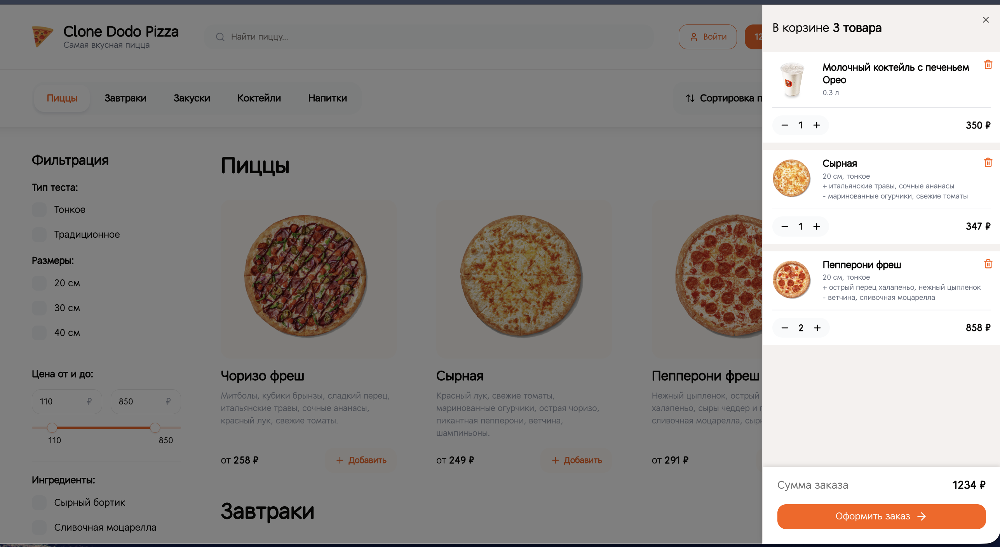
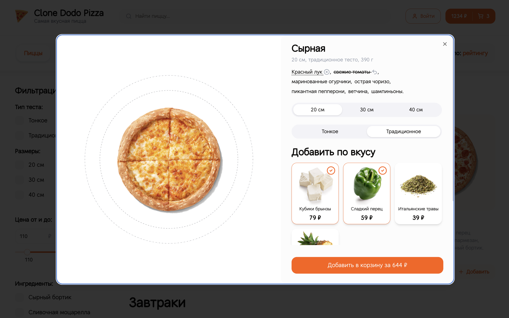
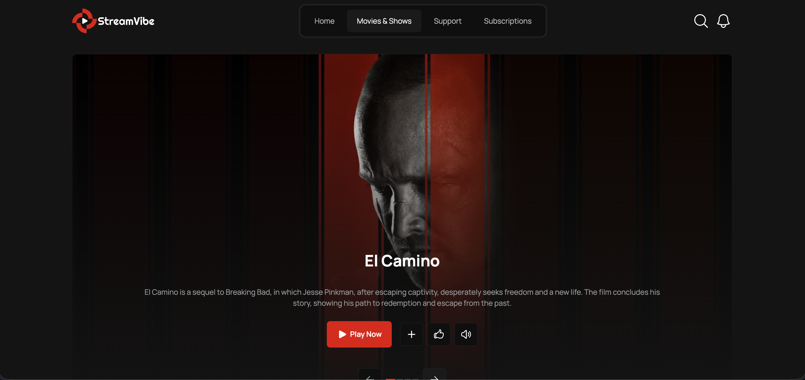
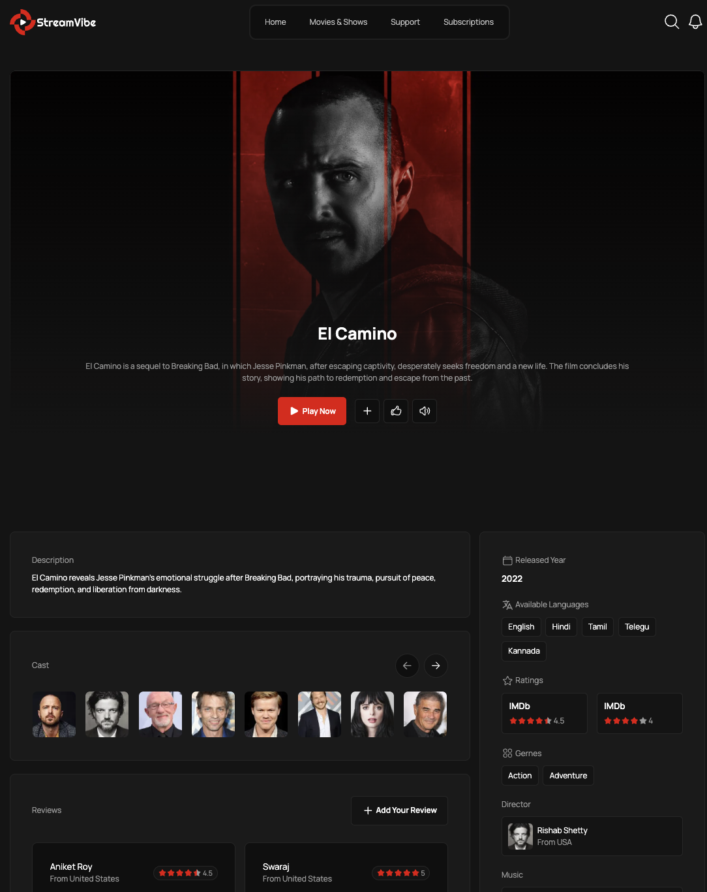

# 👋 Привет, меня зовут Никита!

🧐 Фронтенд-разработчик самоучка

💻 3+ года опыта коммерческой разработки

💼 Работал как в курпных компаниях, так и небольших стартапах

🎓 Профессиональное образование в сфере разработки (программирование в компьютерных системах)

<b>🔧 Стек технологий</b>

• HTML (HTML5), EJS, JSX  
• CSS (CSS3), Sass (SCSS), PostCSS, Bootstrap, Tailwind, Animations  
• JavaScript (ES6+, OOP), jQuery, TypeScript  
• React, Next 
• Redux (Redux Toolkit, Redux Persist), Zustand  
• Formik, React Hook Form, Yup, Axios, React Router, React Query  
• Webpack, Vite, Gulp, Rollup  
• ESLint, Stylelint, Prettier  
• Jest, React Testing Library, Enzyme, Chai, Mocha, Vitest  
• REST API, WebSockets, Long Polling  
• BEM, Feature-Sliced Design, Accessibility, UX  
• Git (GitHub, BitBucket, GitLab)  
• Figma, Adobe Photoshop, Avocode     
• Agile, Scrum, Waterfall  

### 💼 Проекты

#### 🍕 Dodo Pizza Clone
E-commerce приложение

- SSR / Server Actions / API Routes (Next.js)  
- Работа с базой данных (Prisma + PostgreSQL)  
- Авторизация (NextAuth)  
- Фильтрация и оптимизация запросов  
- Архитектура FSD  
- Формы (React Hook Form + Zod)  
- Zustand (глобальное состояние)  

**Скриншоты:**  

  
  
  

 

**Стек:** Next.js, TypeScript, TailwindCSS, ShadCN, Prisma, PostgreSQL  

👉 [Ссылка на репозиторий](https://github.com/nikitavorobushkin/clone-dodo-pizza)  

---

#### 🎨 Stream Vibe — сервис просмотра кино (UI / верстка)
Проект для демонстрации навыков верстки

- Адаптивная и кроссбраузерная верстка  
- Компонентный подход (JSX)  
- Продуманная SCSS-архитектура  
- Использование БЭМ-методологии  
- Работа с интерактивными UI-элементами  

**Скриншоты:**  

  
  

**Стек:** HTML, Minista(JSX), SCSS, JavaScript, IMDbApi  

👉 [Ссылка на репозиторий](https://github.com/nikitavorobushkin/stream-vibe)

## 📫 Контакты

- Telegram: https://t.me/vorobushkin_dev
- Email: n.vorobushkin@yandex.com
